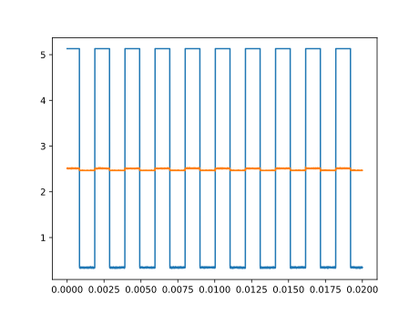

# OpenHantek to Plot

### Little command line program to build a plot out of exported .csv file from [OpenHantek](http://openhantek.org/).

## Usage

    `python main.py -o data/test.csv`

------------

## Help

  -h, --help            show this help message and exit
  -o OPEN, --open OPEN  path to .csv file from OpenHantek
  -w WINDOW, --window WINDOW
                        show the plot in a window?
  -s SAVE, --save SAVE  or path for exporting the file to .svg

------------

## Result

------------

### by PaulusElektrus