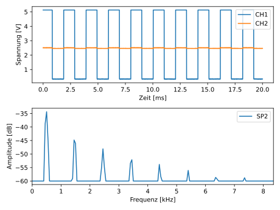

# OpenHantek to Plot

### Little command line program to build a plot out of exported .csv file from [OpenHantek](http://openhantek.org/).

## Usage

    `python plot_app.py data/test.csv`

------------

## Help

positional arguments:
  FILE                  path to a .csv file or folder containing .csv files from OpenHantek

optional arguments:
  -h, --help            show this help message and exit
  -d DISPLAY, --display DISPLAY
                        True displays the plot(s) in a window
  -s SAVE, --save SAVE  specify a path to save the plot(s)

------------

## Result

------------

### by PaulusElektrus