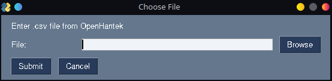

# OpenHantek to Plot

Little command line program with GUI to build a plot out of exported .csv file(s) from [OpenHantek](http://openhantek.org/).

------------

## Command Line Interface

### - Usage:

  -  `python plot.py data/test.csv` --> will store the .svg plot in the same folder

  -  `python plot.py data/test.csv -d True` --> will display the plot in a window

  -  `python plot.py data/test.csv -s plots` --> will store the .svg plot in the plots/ folder

  -  `python plot.py data -s plots` --> will convert all .csv files in data/ in .svg images and store them in plots/

  - ...

### - Help:

- positional arguments:
  
  FILE                  path to a .csv file or folder containing .csv files from OpenHantek

- optional arguments:
 
  -h, --help  -->          show this help message and exit

  -d DISPLAY, --display DISPLAY     -->    True displays the plot(s) in a window

  -s SAVE, --save SAVE --> specify a path to save the plot(s)

------------

## Graphical User Interface

A GUI would be a highlight for this project. I played a bit with [flet](https://flet.dev/), but the results are not good and not working well! So I switched to...

### [PySimpleGUI](https://github.com/PySimpleGUI/PySimpleGUI/tree/master)

Start the GUI with `python gui.py`

------------

## Resulting Plot for 'test.csv':

### by PaulusElektrus